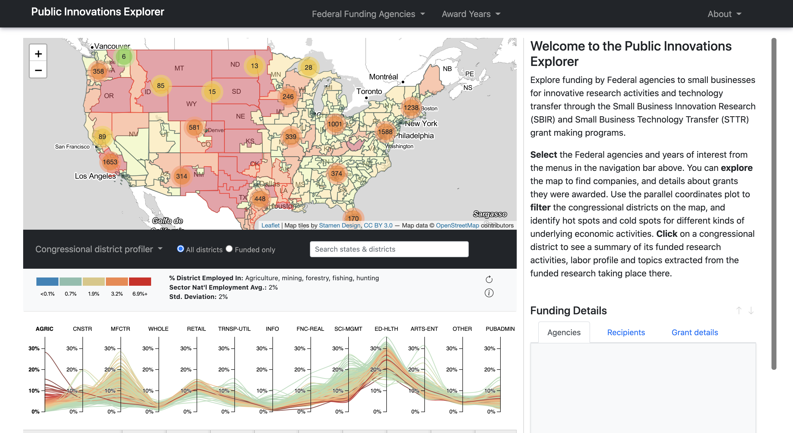

# [The Public Innovations Explorer](https://sethsch.github.io/innovations-explorer/app/index.html)

This project was developed and submitted by [Seth Schimmel](mailto:seth.schimmel@gmail.com) in Spring 2021 towards the capstone requirement for completion of the [Masters of Science in Data Analysis and Visualization at the CUNY Graduate Center](https://www.gc.cuny.edu/Page-Elements/Academics-Research-Centers-Initiatives/Masters-Programs/Data-Analysis-and-Visualization). 
The project was motivated by my professional experience with data mining and analytics development within a private philanthropic foundation, and inspired by computational research methods being applied in social science fields like economic geography, science studies, and bibliometrics.  
   

**The Public Innovations Explorer** is a tool for investigating awards made by Federal agencies and departments participating in the [Small Business Innovation Research (SBIR) and Small Business Technology Transfer (STTR)](https://www.sbir.gov) grant-making programs between 2008 and 2018.  Awards were geocoded at the congressional district level (116th Congress, 2018), allowing users to identify companies performing publicly-funded innovative research in each district and obtain dynamic district-level summaries of funding activity by agency and year.  Additionally, spatial clustering was applied on districts' employment levels across major economic sectors to give users a way of examining the underlying economic activities of districts alongside Federally-funded innovation research activities taking place in a district.  Finally, mathematical and dictionary-based text mining techniques were both used to derive district-level keyword details and provide users with access to some basic keyword stats for each district.

**Go to** [The Public Innovations Explorer](https://sethsch.github.io/innovations-explorer/app/index.html)

**Read more** about the design and methodology via the [official white paper](process/schimmel_whitepaper_final_05252021.pdf) or via the [documentation here](Documentation.md) 

